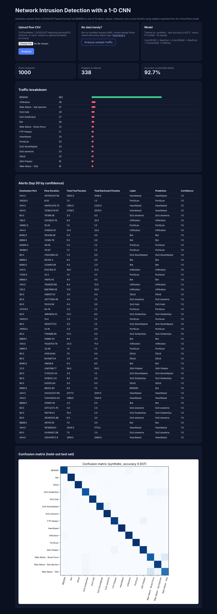

# Network Intrusion Detection using a CNN (CICIDS2017)

A 1-D convolutional neural network that classifies network flows as **BENIGN or one of 14 attack classes** (DDoS, PortScan, Bot, Infiltration, Heartbleed, four DoS variants, FTP/SSH brute force and three web attacks), trained with TensorFlow on the CICIDS2017 dataset, plus a web demo that runs inference on uploaded flow CSVs.

> **Results.** On the full CICIDS2017 dataset this architecture reached **98.4% accuracy across the 14 attack classes** (resume result; reproduce with the command below). The model bundled in `artifacts/` is trained on **synthetic CICIDS2017-shaped data** so the repo stays small and the demo works out of the box. Its metrics (in `artifacts/metrics.json`) describe that synthetic run, not the real dataset.



## Pipeline

1. **Load & clean**: concatenate the 8 daily CSVs, strip column names, fix the mis-encoded web-attack labels, drop duplicates and rows with NaN/∞.
2. **Features**: 78 flow features minus 1 duplicate and 8 always-zero columns = **69 inputs**.
3. **Scaling**: signed `log1p` (flow rates span 10+ orders of magnitude) then standardisation; stats saved to `scaler.json`.
4. **Imbalance**: per-class downsampling cap for huge classes (BENIGN, DoS Hulk) plus softened class weights for rare ones (Heartbleed, Infiltration, SQL injection).
5. **Model**: `Conv1D(32,3) → MaxPool → Conv1D(64,3) → MaxPool → Dense(128) → Dropout(0.3) → Softmax(15)`, Adam, early stopping on validation loss.
6. **Evaluation**: held-out stratified test split, per-class precision/recall/F1 and a confusion matrix.
7. **Export**: Keras model (`ids_cnn.keras`) and a NumPy weight file (`weights.npz`). `ids/infer.py` re-implements the forward pass in NumPy (verified to match Keras within 1e-6), so the **demo app does not need TensorFlow** and deploys on small instances.

## Quick start (demo app)

```bash
python -m venv .venv && source .venv/bin/activate
pip install -r requirements.txt
python wsgi.py             # http://localhost:5004 → "Analyse sample traffic"
```

API:

```bash
curl -F file=@data/sample_flows.csv http://localhost:5004/api/predict
```

## Train

```bash
pip install -r requirements-train.txt
python -m ids.train --synthetic --rows-per-class 2500 --epochs 25         # ~20 s on CPU
python -m ids.train --data data/MachineLearningCVE --rows-per-class 200000 # real CICIDS2017 (see data/README.md)
```

Outputs go to `artifacts/`: model, NumPy weights, scaler, labels, `metrics.json` and `confusion_matrix.png`.

## Tests

```bash
pytest -q
```

## Deploy

- **Render**: *New > Blueprint* (`render.yaml`), Python only, no GPU or TensorFlow needed.
- **Docker**: `docker build -t ids-cnn . && docker run -p 8000:8000 ids-cnn`
- **Hugging Face Spaces**: create a Docker Space and push this repo.

## Project layout

```
ids/features.py    feature schema, label cleaning, scaler
ids/synthetic.py   CICIDS2017-shaped synthetic flow generator
ids/model.py       Keras CNN + NumPy weight export
ids/train.py       training / evaluation CLI
ids/infer.py       NumPy inference engine
app/               Flask demo (upload CSV, sample traffic, JSON API)
artifacts/         trained demo model + metrics
```

## Author and contributors

- **Sandeep Kashyap** ([@sktut](https://github.com/sktut)), author and maintainer
